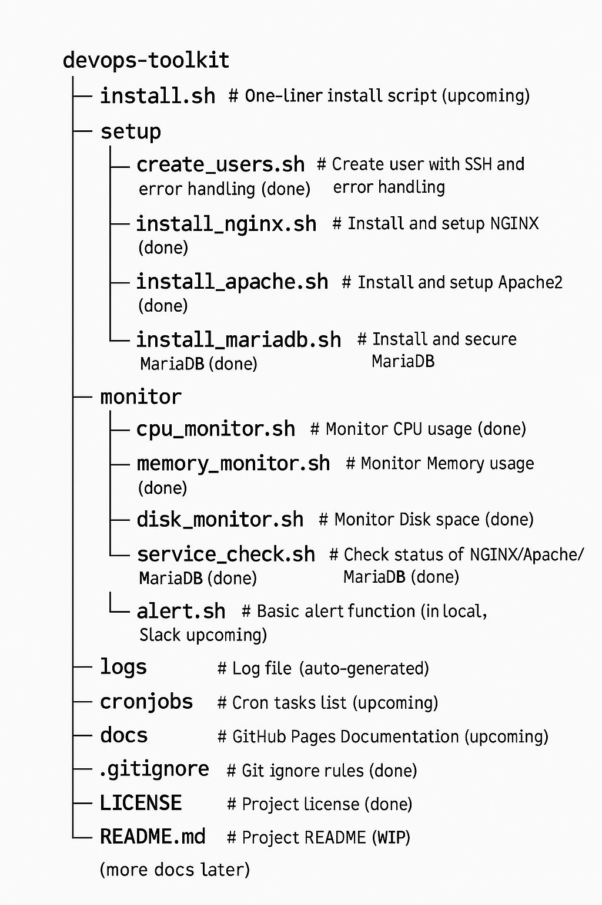

# DevOps-Ready Server Automation & Monitoring Toolkit

A complete Bash-based project for automating server setup and monitoring.  
Built to be modular, scalable, and **DevOps production-ready**.

---

## 📦 Project Structure

---

## ✅ Completed So Far

### 🛠 Setup Scripts
- `create_users.sh` : Create new users with SSH setup and enhanced error handling.
- `install_nginx.sh` : Install and configure the NGINX web server.
- `install_apache.sh` : Install and configure the Apache2 web server.
- `install_mariadb.sh` : Install and secure the MariaDB database server.

### 📊 Monitoring Scripts
- `cpu_monitor.sh` : Monitor CPU usage.
- `memory_monitor.sh` : Monitor memory usage.
- `disk_monitor.sh` : Monitor disk space usage.
- `service_check.sh` : Monitor service status for NGINX / Apache2 / MariaDB.

### 🧹 General
- Initial project structure created.
- `.gitignore` added.
- `LICENSE` file added.

---

## 🚀 Upcoming Work

- **Slack Integration (`alert.sh`)**:  
  Slack webhook alerts for real-time server warnings.

- **install.sh Script**:  
  One-liner script to install all dependencies at once.

- **Enhanced Error Handling and User Input**:  
  Additional improvements in `create_users.sh` and setup scripts.

- **Cronjob Scheduling**:  
  Auto-run monitoring scripts periodically with cron.

- **Documentation**:  
  Full GitHub Pages site (`docs/index.md`) with usage and setup guides.

- **Optional Future**:
  - Dockerize the toolkit for easier deployments.

---

## ✨ Tech Stack

- Bash Scripting
- Linux (Ubuntu/Debian-based servers)
- Git + GitHub
- Slack (for alerts - upcoming)
- Crontab (for auto-monitoring)

---

## 📋 How to Contribute

- Fork the repository 🍴
- Create a new branch 🔧
- Commit your changes 📦
- Submit a pull request 🚀

---

## 🧡 Author

Built by **Atharv Sharma**.

If you like this project, feel free to star ⭐ and contribute!

---
